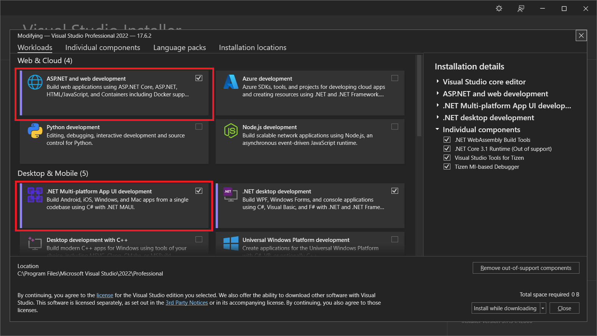
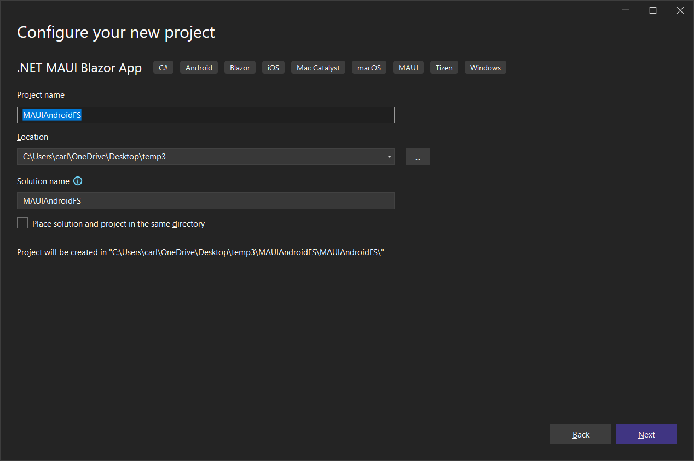
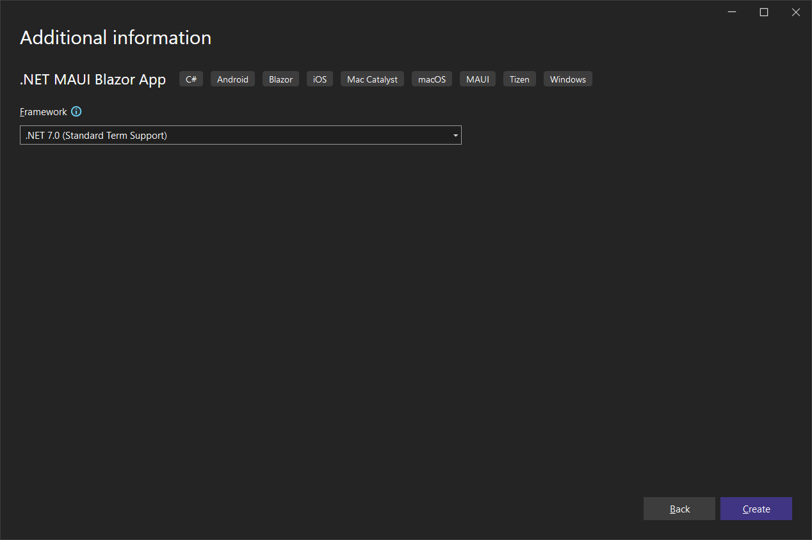
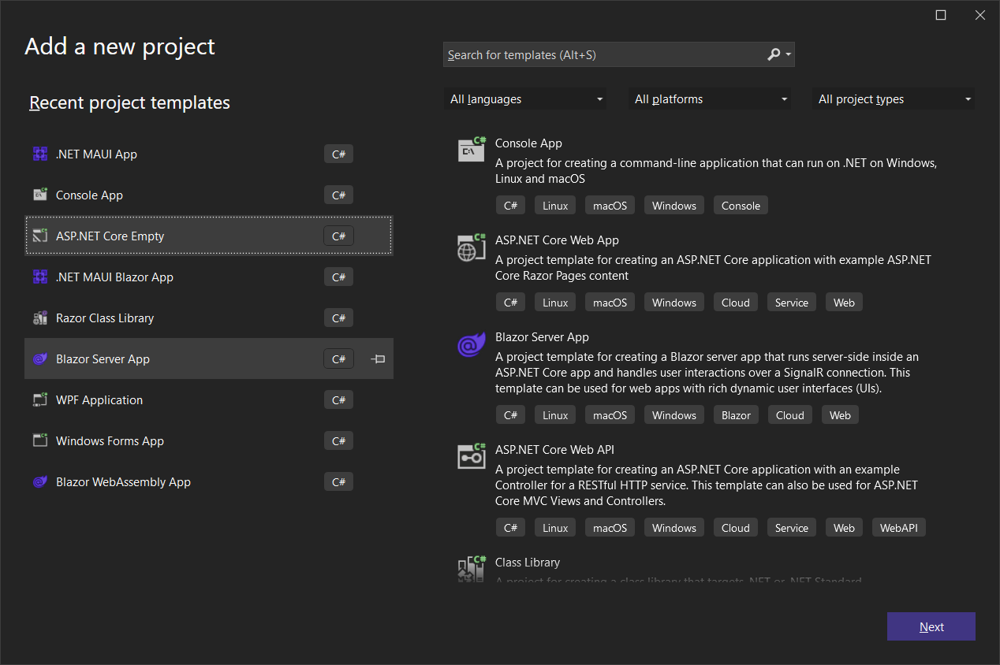
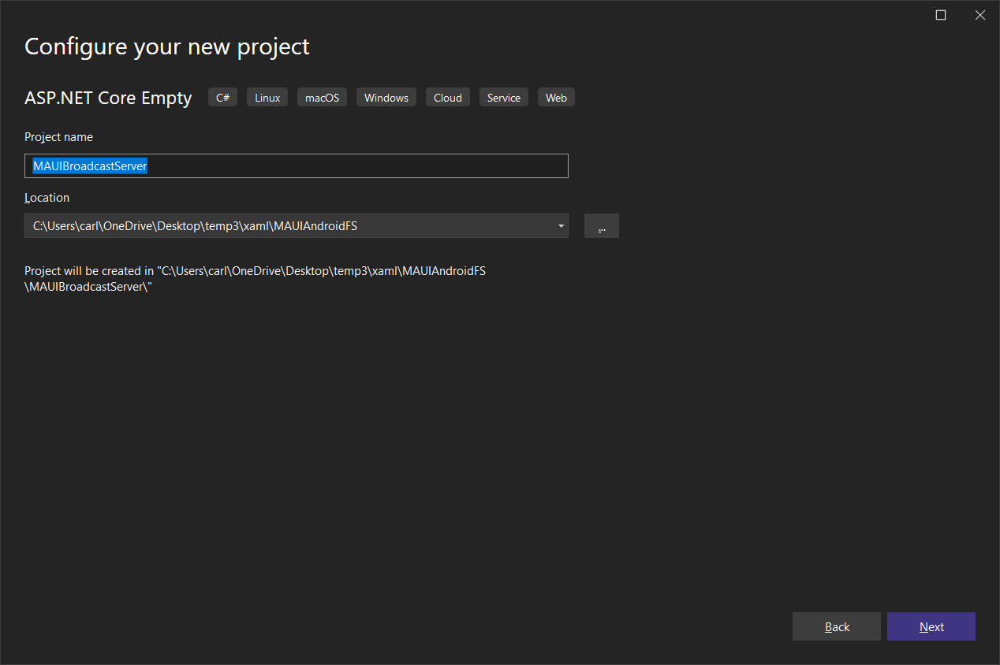
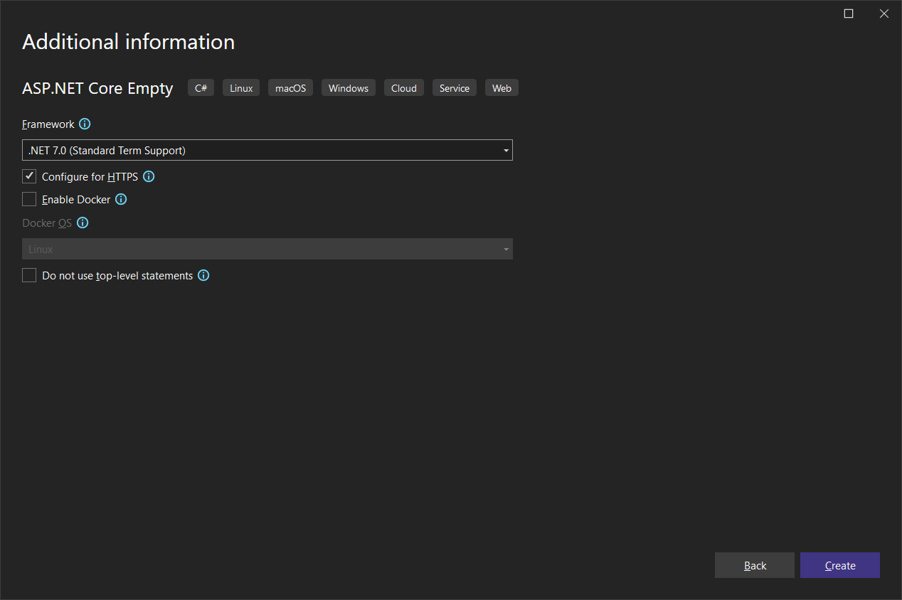
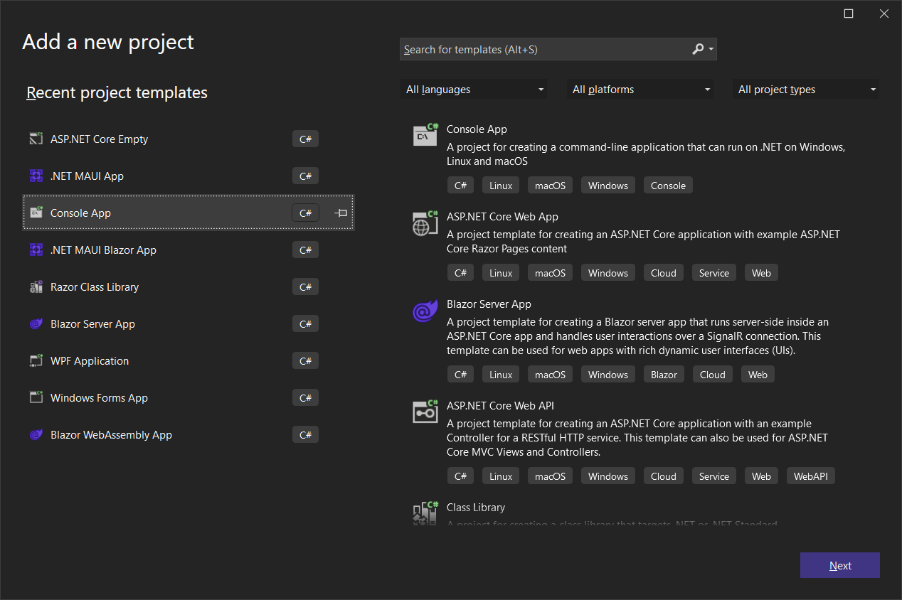
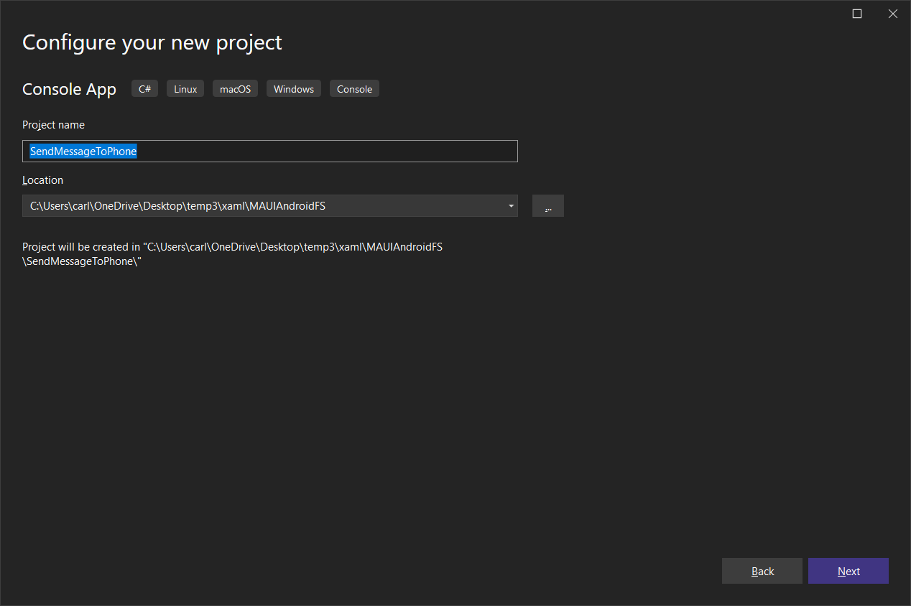
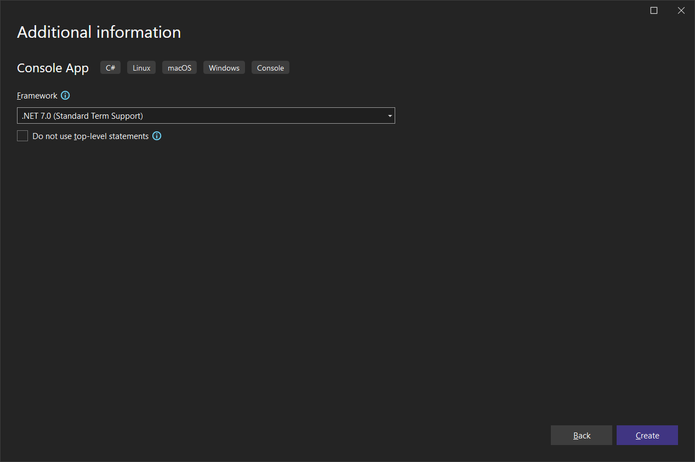

# MAUI Android Background Services

The goal of this module is to create a MAUI Android app that installs a service which runs in the background and starts automatically when the phone boots up. There is no limit to how long the service can run, but we will be judicious about CPU and memory usage.

For these demos you can use either **MAUI XAML** or **MAUI Blazor**. Most of the code is Android-specific with very little UI. 

This module consists of two demos. In the first demo we'll spin up a timer that shows a notification every 10 seconds. This is just to show us that our code is running in the background, and that we can show notifications.

In the second demo we will implement a SignalR system by which the service can receive push messages and display them. 

> :warning: This code should ***not*** be used as-is in production due to the fact that there's zero security around the messaging. Also, SignalR does not queue messages. If your Android app misses them, they are gone forever. 

So, to reiterate, the point is to learn how to write a background service for your Android apps, from which you can show notifications. How you get data in production is beyond the scope of the demo.

## Prerequisites

The following prerequisites are needed for this demo.

### Visual Studio 2022

For this module, we are going to use [Visual Studio 2022](https://visualstudio.microsoft.com/vs/community/) with .NET 7

### Required Workloads

In order to build ASP.NET Core Web applications, the `ASP.NET and web development` workload needs to be installed. In order to build `.NET MAUI` applications, you also need the `.NET Multi-platform App UI development` workload.

Here's a screen shot of the Visual Studio Installer.



## Overview

I have a confession to make. We're actually going to create a **Foreground Service** as opposed to a **Background Service**. In Android, there is a distinction.

> Background services can not display a notification to the user while it is running. However, since Android 8.0 (API level 26), the system places restrictions on what such services can do while they are running in the background, in order to conserve system resources. This means that you can't ensure that your service will always be running.
>

> Foreground services are one of the most reliable ways to ensure that your service is not stopped by the Android system to reclaim resources. Foreground services can display notifications while they are running. 
>

I want a service that 

- runs in the background 
- can be registered (and run) by a MAUI Android app
- doesn't require the UI (MAUI App) to be running
- can be stopped by the MAUI App
- can be uninstalled when the MAUI App is uninstalled
- can show notifications
- can set the number in the little red circle on the app icon

By "little red circle", I mean this:


I started with the code [in this blog post](https://putridparrot.com/blog/android-foreground-service-using-maui/) by Mark Timmings. It was a good start, but I ended up with something more suited to my needs. Mark's post doesn't cover automatically starting the service when the phone boots up, for example. Still, it was a great start, and I quote him at times in this documentation.

### Let's Go!

Create either a **.NET MAUI App** or a **.NET MAUI Blazor App** called **MAUIAndroidFS**






**Create the service itself**

Add *Platforms/Android/MyBackgroundService.cs*:

```c#
using Android.App;
using Android.Content;
using Android.OS;
using AndroidX.Core.App;

namespace MAUIAndroidFS.Platforms.Android;

[Service]
internal class MyBackgroundService : Service
{
    Timer timer = null;
    int myId = (new object()).GetHashCode();
    int BadgeNumber = 0;
    private readonly IBinder binder = new LocalBinder();

    public class LocalBinder : Binder
    {
        public MyBackgroundService GetService()
        {
            return this.GetService();
        }
    }

    public override IBinder OnBind(Intent intent)
    {
        return binder;
    }

    public override StartCommandResult OnStartCommand(Intent intent,
        StartCommandFlags flags, int startId)
    {
        var input = intent.GetStringExtra("inputExtra");

        var notificationIntent = new Intent(this, typeof(MainActivity));
        notificationIntent.SetAction("USER_TAPPED_NOTIFIACTION");
        
        var pendingIntent = PendingIntent.GetActivity(this, 0, notificationIntent,
            PendingIntentFlags.UpdateCurrent);

        var notification = new NotificationCompat.Builder(this,
                MainApplication.ChannelId)
            .SetContentText(input)
            .SetSmallIcon(Resource.Drawable.AppIcon)
            .SetContentIntent(pendingIntent);

        StartForeground(myId, notification.Build());

        timer = new Timer(Timer_Elapsed, notification, 0, 10000);

        // You can stop the service from inside the service by calling StopSelf();

        return StartCommandResult.Sticky;
    }

    /// <summary>
    /// 
    /// </summary>
    /// <param name="state"></param>
    void Timer_Elapsed(object state)
    {
        AndroidServiceManager.IsRunning = true;

        BadgeNumber++;
        string timeString = $"Time: {DateTime.Now.ToLongTimeString()}";
        var notification = (NotificationCompat.Builder)state;
        notification.SetNumber(BadgeNumber);
        notification.SetContentTitle(timeString);
        notification.SetContentText(timeString);
        StartForeground(myId, notification.Build());

    }
}
```

This class inherits *Android.App.Service*, which allows you to override the base class `OnStartCommand` virtual method. We are also using the `[Service]` attribute.

> :point_up: Even though I called it `MyBackgroundService`, it is technically a foreground service, but still runs in the background.

Check out line 12:

```c#
int myId = (new object()).GetHashCode();
```

This is basically a random integer that I can use as an ID. It's not really necessary, but I'm not a fan of using magic numbers.

Look at lines 14-27:

```c#
private readonly IBinder binder = new LocalBinder();

public class LocalBinder : Binder
{
    public MyBackgroundService GetService()
    {
        return this.GetService();
    }
}

public override IBinder OnBind(Intent intent)
{
    return binder;
}
```

The `LocalBinder` class is a simple `Binder` abstraction with a `GetService()` method returning the service.

Let's dive into the `OnStartCommand` method, which we are overriding.

The first thing we do is retrieve a string, which we set in `MainActivity`.  This value should be "Background Service".

```c#
var input = intent.GetStringExtra("inputExtra");
```

Line 34 creates an intent linked to the app itself via `MainActivity`:

```c#
var notificationIntent = new Intent(this, typeof(MainActivity));
```

An `Intent` is a software mechanism for describing an operation to be performed. It's a way to pass data between components of an Android application, but it also allows communication between different applications.

Line 35 sets an Action on the intent, which we can inspect when the intent is processed (more on that later):

```c#
notificationIntent.SetAction("USER_TAPPED_NOTIFIACTION");
```

The Intent we want will ensure that when the user taps on a notification, it will bring up the App.

However, we can't use the `notificationIntent` directly. We have to create a `PendingIntent` from it with the code in lines 37 and 38:

```c#
var pendingIntent = PendingIntent.GetActivity(this, 0, notificationIntent,
    PendingIntentFlags.UpdateCurrent);
```

Lines 40-44 create a `NotificationCompat.Builder`, which is used to trigger a notification.

```c#
var notification = new NotificationCompat.Builder(this,
        MainApplication.ChannelId)
    .SetContentText(input)
    .SetSmallIcon(Resource.Drawable.AppIcon)
    .SetContentIntent(pendingIntent);
```

This requires the service reference (`this`), and the `MainApplication.ChannelId`, which we will set in *MainApplication.cs*.

Notice the methods we are calling:

- `SetContentText` sets the text of the notification. There are two text fields: Text and Title. 
- `SetSmallIcon` defines the icon that will display at the very top left of the phone screen when the service is running.
- `SetContentIntent` sets the intent, which links the notification back to our app.

It's a good practice to start the service right here, so the next line does just that:

```c#
StartForeground(myId, notification.Build());
```

At this point you can kick off a worker thread, initialize a timer, set up a pub/sub event handler, or do whatever you need to do in the background. Just be careful you don't take up too much CPU and/or memory as the phone's battery will run down faster. 

For the first part of the demo, we'll instantiate the timer on line 48:

```c#
timer = new Timer(Timer_Elapsed, notification, 0, 10000);
```

This code basically says "call the Timer_Elapsed method passing the notification, starting in 0 milliseconds, and repeating every 10 seconds."

This isn't good production code, but it proves that the service is running in the background.

Finally, line 52 returns this:

```c#
return StartCommandResult.Sticky;
```

*StartCommandResult.Sticky* is used to tell the OS to recreate the service when it has enough memory after running out of memory. You can also specify *StartCommandResult.NotSticky*. This tells the OS to not bother recreating the application if (for example) the device runs out of memory. 

Replace */Platforms/Android/MainApplication.cs* with the following:

```c#
using Android.App;
using Android.OS;
using Android.Runtime;

namespace MAUIAndroidFS;

[Application]
public class MainApplication : MauiApplication
{
    public static readonly string ChannelId = "backgroundServiceChannel";

    public MainApplication(IntPtr handle, 
        JniHandleOwnership ownership) : base(handle, ownership)
    {
    }

    protected override MauiApp CreateMauiApp() => 
        MauiProgram.CreateMauiApp();

    public override void OnCreate()
    {
        base.OnCreate();

        if (Build.VERSION.SdkInt >= BuildVersionCodes.O)
        {
#pragma warning disable CA1416
            var serviceChannel =
                new NotificationChannel(ChannelId, 
                    "Background Service Channel", 
                NotificationImportance.High);

            if (GetSystemService(NotificationService) 
                is NotificationManager manager)
            {
                manager.CreateNotificationChannel(serviceChannel);
            }
#pragma warning restore CA1416
        }
    }
}
```

Look at `OnCreate()`, which we are overriding.

> The `CA1416` warning is related to platform compatibility checks in .NET. It's part of a set of warnings and errors that help developers avoid inadvertently using APIs that are not available on the platforms they intend to run their code on. CA1416 specifically warns when code uses an API that doesn't exist on the platforms specified in the `[SupportedOSPlatform]` and `[UnsupportedOSPlatform]` attributes. By writing `#pragma warning disable CA1416`, the developer is saying "I know this code might be using APIs that aren't available on all platforms, but I want to suppress the warnings about it."

We are creating a `NotificationChannel` with the `ChannelId` we defined on line 10. 

The notification has a name “Background Service Channel” and an importance level of **High**. 

Finally, we are creating the notification channel, which can be accessed by the `ChannelId`.

Replace */Platforms/Android/MainActivity.cs* with the following:

```c#
using Android.App;
using Android.Content.PM;
using Android.Content;
using MAUIAndroidFS.Platforms.Android;

namespace MAUIAndroidFS;

[Activity(Theme = "@style/Maui.SplashTheme", MainLauncher = true,
    LaunchMode = LaunchMode.SingleTop,
    ConfigurationChanges = ConfigChanges.ScreenSize | ConfigChanges.Orientation
    | ConfigChanges.UiMode | ConfigChanges.ScreenLayout
    | ConfigChanges.SmallestScreenSize | ConfigChanges.Density)]
public class MainActivity : MauiAppCompatActivity
{
    public MainActivity()
    {
        AndroidServiceManager.MainActivity = this;
    }

    protected override void OnNewIntent(Intent intent)
    {
        base.OnNewIntent(intent);
        // Handle the intent that you received
        ProcessIntent(intent);
    }

    private void ProcessIntent(Intent intent)
    {
        // Extract data from the intent and use it
        // For example, you can check for a specific action or extract extras
        if (intent != null)
        {
            // Example: checking for a specific action
            var action = intent.Action;
            if (action == "USER_TAPPED_NOTIFIACTION")
            {
                // Handle the specific action
            }
        }
    }

    public void StartService()
    {
        var serviceIntent = new Intent(this, typeof(MyBackgroundService));
        serviceIntent.PutExtra("inputExtra", "Background Service");
        StartService(serviceIntent);
    }

    public void StopService()
    {
        var serviceIntent = new Intent(this, typeof(MyBackgroundService));
        StopService(serviceIntent);
    }
}
```

Line 17 deserves an explanation:

```c#
AndroidServiceManager.MainActivity = this;
```

Scroll down to see the `AndroidServiceManager` class, which I've introduced as a way to provide a little state between the Android code, the service, and the UI. `MainActivity` is a static property that lets us share the reference. We'll get back to that.

Check out `StartService()`:

```c#
public void StartService()
{
    var serviceIntent = new Intent(this, typeof(MyBackgroundService));
    serviceIntent.PutExtra("inputExtra", "Background Service");
    StartService(serviceIntent);
}
```

Line 21 creates an intent associated with our service code (`MyBackgroundService`). We add a key/value in the *PutExtra* method. The key is whatever we want and obviously the value is whatever we want to associated with the key. This will be handled via our service, so the key would best be a `const` in a production application, or simply make it a public static string field in the `AndroidServiceManager`. 

Finally we call the base `StartService` passing the Intent.

`StopService()` creates the intent just as above, but then passes it to the base `StopService()` method.

Add the following class to the project

*/Platforms/Android/AndroidServiceManager.cs*:

```c#
namespace MAUIAndroidFS.Platforms.Android;

public static class AndroidServiceManager
{
    public static MainActivity MainActivity { get; set; }

    public static bool IsRunning { get; set; }

    public static void StartMyService()
    {
        if (MainActivity == null) return;
        MainActivity.StartService();
    }

    public static void StopMyService()
    {
        if (MainActivity == null) return;
        MainActivity.StopService();
        IsRunning = false;
    }
}
```

We need access to the `MainActivity` in order to start and stop the service, which we want to do from the UI layer.

Notice that `IsRunning` is not set in `StartMyService()`. We will set that in the service itself once the code is running.

Add the following class to the project:

*/Platforms/Android/BootReceiver.cs*:

```c#
using Android.App;
using Android.Content;
using Android.Widget;
using AndroidX.Core.Content;

namespace MAUIAndroidFS.Platforms.Android;

[BroadcastReceiver(Enabled = true, Exported = true, DirectBootAware = true)]
[IntentFilter(new[] { Intent.ActionBootCompleted })]
public class BootReceiver : BroadcastReceiver
{
    public override void OnReceive(Context context, Intent intent)
    {
        if (intent.Action == Intent.ActionBootCompleted)
        {
            Toast.MakeText(context, "Boot completed event received", 
                ToastLength.Short).Show();

            var serviceIntent = new Intent(context, 
                typeof(MyBackgroundService));

            ContextCompat.StartForegroundService(context, 
                serviceIntent);
        }
    }
}
```

This is the class we can use to start the service when the phone boots up.

It inherits `BroadcastReceiver`, which does the real work.

Lines 16 and 17 show a toast popup so we will know that the service is about to start on boot up.

```c#
Toast.MakeText(context, "Boot completed event received", 
    ToastLength.Short).Show();
```

Be on the lookout for that.  The phone has to be on in order for you to see it.

Now, perhaps the most important piece: configuration.

Replace */Platforms/Android/AndroidManifext.xml* with the following:

```xml
<?xml version="1.0" encoding="utf-8"?>
<manifest xmlns:android="http://schemas.android.com/apk/res/android">
	<uses-permission android:name="android.permission.RECEIVE_BOOT_COMPLETED" />
	<uses-permission android:name="android.permission.ACCESS_NETWORK_STATE" />
	<uses-permission android:name="android.permission.INTERNET" />
	<uses-permission android:name="android.permission.FOREGROUND_SERVICE" />
	<uses-permission android:name="android.permission.SYSTEM_ALERT_WINDOW"/>
	<uses-permission android:name="android.permission.FLAG_KEEP_SCREEN_ON"/>
	<application android:name="MAUIAndroidFS.MainApplication"
                 android:debuggable="true"
                 android:enabled="true"
                 android:allowBackup="true"
                 android:icon="@mipmap/appicon"
                 android:roundIcon="@mipmap/appicon_round"
                 android:supportsRtl="true">
		<receiver android:name=".BootReceiver"
                  android:directBootAware="true"
                  android:enabled="true"
                  android:exported="true">
			<intent-filter>
				<action android:name="android.intent.action.BOOT_COMPLETED" />
				<category android:name="android.intent.category.DEFAULT" />
			</intent-filter>
		</receiver>
	</application>
</manifest>
```

The four permissions expressed at the top are all necessary:

```xml
<uses-permission android:name="android.permission.RECEIVE_BOOT_COMPLETED" />
<uses-permission android:name="android.permission.ACCESS_NETWORK_STATE" />
<uses-permission android:name="android.permission.INTERNET" />
<uses-permission android:name="android.permission.FOREGROUND_SERVICE" />
<uses-permission android:name="android.permission.SYSTEM_ALERT_WINDOW"/>
<uses-permission android:name="android.permission.FLAG_KEEP_SCREEN_ON"/>
```

Some values you might need to change are:

```xml
<application android:name="MAUIAndroidFS.MainApplication"
```

depending on the name of your application. And:

```c#
<receiver android:name=".BootReceiver"
```

depending on the name of your BroadcastReceiver.

> :point_up: At some point you may need the name of the `BootReceiver` class in *BootReceiver.cs* and also the reference to it in */Platforms/Android/AndroidManifest.xml* if, for example, the service doesn't automatically start on reboot. Just add a number to the end of the name. Ex: `class BootReceiver1`. I found that after deploying the app multiple times, this is necessary.

## User Interface

The purpose of the user interface is to

- start the service (on load) if it's not already running
- allow the user to stop the service

### For MAUI XAML:

If you chose the **.NET MAUI App** template (as opposed to Blazor), replace *MainPage.xaml* with the following:

```xaml
<?xml version="1.0" encoding="utf-8" ?>
<ContentPage xmlns="http://schemas.microsoft.com/dotnet/2021/maui"
             xmlns:x="http://schemas.microsoft.com/winfx/2009/xaml"
             x:Class="MAUIAndroidFS.MainPage">

    <VerticalStackLayout Margin="20">
        <Button Clicked="StopButton_Clicked" Text="Stop Service"></Button>
        <Label x:Name="MessageLabel" FontSize="20" />
    </VerticalStackLayout>

</ContentPage>
```

Replace *MainPage.xaml.cs* with the following:

```c#
namespace MAUIAndroidFS;

public partial class MainPage : ContentPage
{
	public MainPage()
	{
		InitializeComponent();
        this.Loaded += MainPage_Loaded;
	}

    private void MainPage_Loaded(object sender, EventArgs e)
    {
#if ANDROID
        if (!MAUIAndroidFS.Platforms.Android.AndroidServiceManager.IsRunning)
        {
            MAUIAndroidFS.Platforms.Android.AndroidServiceManager.StartMyService();
            MessageLabel.Text = "Service has started";
        }
        else{
            MessageLabel.Text = "Service is running";
        }
#endif
    }

    private void StopButton_Clicked(object sender, EventArgs e)
    {
#if ANDROID
        MAUIAndroidFS.Platforms.Android.AndroidServiceManager.StopMyService();
        MessageLabel.Text = "Service is stopped";
#endif
    }
}
```

It should be easy to understand. 

We are using `AndroidServiceManager`:

- to determine if the service is already running
- to start the service
- to stop the service

### For MAUI  Blazor:

Replace */Pages/Index.razor* with the following:

```c#
@page "/"

<button class="btn btn-primary" @onclick="StopService">Stop Service</button>
<br/>
<h3>@Message</h3>

@code
{
    string Message = string.Empty;

    void StopService()
    {
#if ANDROID
        MAUIAndroidFS.Platforms.Android.AndroidServiceManager.StopMyService();
        Message = "Service is stopped";
#endif
    }

    protected override void OnInitialized()
    {
#if ANDROID
        if (!MAUIAndroidFS.Platforms.Android.AndroidServiceManager.IsRunning)
        {
            MAUIAndroidFS.Platforms.Android.AndroidServiceManager.StartMyService();
            Message = "Service has started";
        }
        else{
            Message = "Service is running";
        }
#endif
    }
}
```

It's pretty-much the same as the XAML version. We are using the `OnInitialized()` virtual method as the place where we start the service if it is not already running.

**Add */Platforms/Android/Resources/Drawable/AppIcon.png***

Grab this icon from the repo, or use any 32x32 png file.

Run the app on your local android device.

Let it run until you get at least one message, then restart the phone. The messages should start shortly after booting up. 

> :point_up: If after several minutes you do not start seeing notifications, you may be hitting a snag that I hit. Change the name of the `BootReceiver` class in *BootReceiver.cs* and also the reference to it in */Platforms/Android/AndroidManifest.xml*

## Using SignalR to Push Notifications

In the second demo, we'll use SignalR. We'll create a SignalR Hub for broadcasting messages. We'll subscribe to those messages in the Android service, and we'll create a console app for sending messages to  the service on the phone via SignalR. The service will then display the message as a notification and increment the number in the little red circle on the app icon.

To the solution add a new **ASP.NET Core Empty** project named **MAUIBroadcastServer**







Replace *Program.cs* with the following:

```c#
global using Microsoft.AspNetCore.SignalR;
using MAUIBroadcastServer;

var builder = WebApplication.CreateBuilder(args);

builder.Services.AddSignalR();

var app = builder.Build();

app.MapGet("/", () => "Hello World!");

app.MapHub<BroadcastHub>("/BroadcastHub");

app.Run();
```

Add the following class:

*BroadcastHub.cs*:

```c#
namespace MAUIBroadcastServer;
public class BroadcastHub : Hub
{
    public async Task SendMessage(string message)
    {
        await Clients.Others.SendAsync("ReceiveMessage", message);
    }
}
```

#### Publish MAUIBroadcastServer to Azure

If you need help, the [documentation](https://learn.microsoft.com/en-us/azure/app-service/quickstart-dotnetcore?tabs=net70&pivots=development-environment-vs) is excellent.

Make a note of the name of your web app. You'll need it for the next step. Mine is (or was) **mauibroadcastserver**. You will have to choose a unique name.

### Add a Console App

Let's add a **Console App** project to the solution to send messages to the SignalR hub. Name it **SendMessageToPhone**:







Add the SignalR client package to the project:

```xml
<ItemGroup>
    <PackageReference Include="Microsoft.AspNetCore.SignalR.Client" Version="7.0.5" />
</ItemGroup>
```

Replace *Program.cs* with the following:

```c#
using Microsoft.AspNetCore.SignalR.Client;

string Message = "";
HubConnection hubConnection;

hubConnection = new HubConnectionBuilder()
.WithUrl("https://[YOUR-AZURE-SERVER-NAME].azurewebsites.net/BroadcastHub")
.Build();

try
{
    await hubConnection.StartAsync();
}
catch (Exception e)
{
    Console.WriteLine(e.Message);
    return;
}

while (true)
{
    Console.WriteLine("Enter a message to send to the phone, or press ENTER to exit");
    Message = Console.ReadLine();
    if (Message == "")
        break;

    await hubConnection.InvokeAsync("SendMessage", Message);
}
```

Make sure to replace `[YOUR-AZURE-SERVER-NAME]` with your actual published web app name.

### Modify the MAUI App to use SignalR

Add the SignalR Client package to the MAUI App:

```xml
<PackageReference Include="Microsoft.AspNetCore.SignalR.Client" Version="7.0.5" />
```

Replace */Platforms/Android/MyBackgroundService.cs* with the following:

```c#
using Android.App;
using Android.Content;
using Android.OS;
using AndroidX.Core.App;
using Microsoft.AspNetCore.SignalR.Client;

namespace MAUIAndroidFS.Platforms.Android;

[Service]
internal class MyBackgroundService : Service
{
    Timer timer = null;
    int myId = (new object()).GetHashCode();
    int BadgeNumber = 0;
    NotificationCompat.Builder notification;
    HubConnection hubConnection;

    public override IBinder OnBind(Intent intent)
    {
        return null;
    }

    public override StartCommandResult OnStartCommand(Intent intent,
        StartCommandFlags flags, int startId)
    {
        var input = intent.GetStringExtra("inputExtra");

        var notificationIntent = new Intent(this, typeof(MainActivity));
        var pendingIntent = PendingIntent.GetActivity(this, 0, notificationIntent,
            PendingIntentFlags.Immutable);

        notification = new NotificationCompat.Builder(this,
                MainApplication.ChannelId)
            .SetContentText(input)
            .SetSmallIcon(Resource.Drawable.AppIcon)
            .SetContentIntent(pendingIntent);

        // Increment the BadgeNumber
        BadgeNumber++;
        // set the number
        notification.SetNumber(BadgeNumber);
        // set the title (text) to Service Running
        notification.SetContentTitle("Service Running");
        // build and notify
        StartForeground(myId, notification.Build());

        // timer to ensure hub connection
        timer = new Timer(Timer_Elapsed, notification, 0, 10000);

        // You can stop the service from inside the service by calling StopSelf();

        return StartCommandResult.Sticky;
    }

    async Task EnsureHubConnection()
    {
        if (hubConnection == null)
        {
            hubConnection = new HubConnectionBuilder()
                .WithUrl("https://[YOUR-AZURE-SERVER-NAME].azurewebsites.net/BroadcastHub")
                .Build();

            hubConnection.On<string>("ReceiveMessage", (message) =>
            {
                // Display the message in a notification
                BadgeNumber++;
                notification.SetNumber(BadgeNumber);
                notification.SetContentTitle(message);
                StartForeground(myId, notification.Build());
            });
            try
            {
                await hubConnection.StartAsync();
            }
            catch (Exception e)
            {
                // Put a breakpoint on the next line to debug
            }

        }
        else if (hubConnection.State != HubConnectionState.Connected)
        {
            try
            {
                await hubConnection.StartAsync();
            }
            catch (Exception e)
            {
                // Put a breakpoint on the next line to debug
            }
        }
    }

    /// <summary>
    /// 
    /// </summary>
    /// <param name="state"></param>
    async void Timer_Elapsed(object state)
    {
        AndroidServiceManager.IsRunning = true;

        await EnsureHubConnection();
    }
}
```

Again, replace `[YOUR-AZURE-SERVER-NAME]` with your Azure web app name.

Uninstall the app from the Android Phone, and run it again.

Wait until you get the "Service Running" notification, then close the app.

Restart the phone and wait until you get the "Service Running" notification.

> :point_up: If after several minutes you do not start seeing notifications, you may be hitting a snag that I hit. Change the name of the `BootReceiver` class in *BootReceiver.cs* and also the reference to it in */Platforms/Android/AndroidManifest.xml* Delete the app on the phone, and redeploy it

Set the **SendMessageToPhone** project as the startup project and run it.

Enter a message and see if you don't receive it on your phone.

## Battery Life

`MyBackgroundService` currently uses a timer to check the state of the `HubConnection` once every 10 seconds. I let it run overnight, and in 10 hours the battery went down 6%. 

The next day I changed the interval to 60 seconds, and over 10 hours the battery went down only 2%.

If you're going to use this approach to either poll for new data on a timer or check the status of your connection, you'll probably want to do a similar test.

